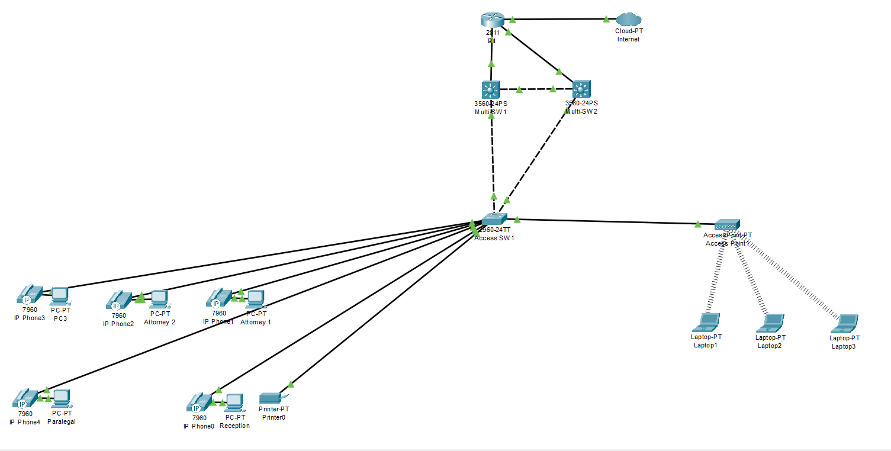

## Project Overview
This project simulates a network designed for a small law firm. It implements a collapsed-core architecture, focusing on logical VLAN segmentation, high availability at the routing layer by using HSRP, and strict access control lists (ACL) to isolate internal department from the guest network. 

## Reference Topology

## Physical Topology
- Core/Distribution: 2x Layer 3 Switches (Multi-SW1, Multi-SW2)
- Access: 1x Layer 2 Switch (Access SW1)
- Wireless: 1x Access Point (Bridge mode)
- Edge/Perimeter: 1x Router (EDGE_R1)

##Logical Segmentation (VLANs) 
To isolate the traffic and enforce security boundaries, the network utilizes dedicated /24 subnets within the 192.168.0.0 private IP space.  
The VLAN assignments are structured as follows: 

- VLAN 10: Attorneys
- VLAN 20: Paralegals
- VLAN 30: Reception
- VLAN 40: Printers
- VLAN 50: Guest Wi-Fi
- VLAN 60: Voice
- VLAN 99: IT Management

 
##Layer 2 Configuration 
    - Trunking: Dynamic Trunking Protocol (DTP) is intentionally disabled. 
    Inter-switch links are statically configured as 802.1Q trunks, and unused VLANs are pruned from the allowed list. 
    - Spanning Tree Protocol (STP): Configured to prevent loops and optimize routing paths
      - Multi-SW1 is configured as the Root Bridge (Priority 4096).
      - Multi-SW2 is configured as the Secondary Bridge (Priority 8192).
    - Port Security: Edge ports are restricted to a maximum of 2 MAC addresses. 
    Violations are set to Restrict mode to drop unauthorized frames and generate syslog events without disabling the interface.

##Layer 3 & High Availability 
- Inter-VLAN Routing: Configured via Switch Virtual Interfaces (SVIs) on the core switches (Multi-SW1 and Multi-SW2).
- Hot Standby Router Protocol (HSRP): Provides active/standby gateway redundancy for all VLANs.
- Multi-SW1 is the Active gateway (Priority 110) with preemption enabled.
- Multi-SW2 is the Standby gateway (Priority 100).
- Edge Routing: EDGE_R1 uses a primary static default route to the ISP and a floating static route (Administrative Distance 10) for automated fail-over.

##Network Services 
- DHCP: Multi-SW1 acts as the DHCP server for dynamic endpoints. The first 9 IP addresses of every subnet (e.g., .1 through .9) are explicitly excluded from the pool to reserve space for gateways and static infrastructure.
- NAT: Port Address Translation (PAT/NAT Overload) is configured on EDGE_R1 to translate internal private IPs to the public interface IP for internet access.

##Security Controls 
- DHCP Snooping: Applied at the access layer to prevent rogue DHCP server attacks. Uplinks are configured as trusted; edge ports are untrusted and rate-limited to 15 packets per second.
- Extended Access Control Lists (ACLs): Applied inbound on the Guest Wi-Fi SVI (VLAN 50). The rules permit the guest network to ping its local gateway and access the internet, but explicitly deny access to the 192.168.0.0/16 internal network.
- Management Plane Hardening: Telnet is disabled globally. All Virtual Terminal (VTY) lines require local database authentication, enforce SSH (transport input ssh), and use an ACL (access-class 10 in) to restrict login attempts exclusively to the Management VLAN (VLAN 99).

##Validation & Troubleshooting 
During the deployment phase, several configuration problems were identified and resolved using standard troubleshooting methods: 
- **Issue: Guest laptops failed to connect, assigning themselves default APIPA addresses (169.254.x.x).
  **Resolution: Identified that the wireless Access Point functions strictly as a Layer 2 bridge. Resolved the issue by configuring a centralized DHCP pool on the core switch to pass IP leases through the bridge to the wireless clients.
  
- **Issue: All legitimate guest traffic was being dropped at the gateway.
  **Resolution: Audited the Guest VLAN Access Control List (ACL) and discovered a source subnet misalignment (192.168.60.0 instead of 192.168.50.0). Deleted the flawed residual rules to free up switch memory and rebuilt the ACL to target the correct IP space.

- **Issue: The edge router's NAT translation table appeared empty during initial baseline checks.
  **Resolution: Recognized this as standard behavior for Port Address Translation (PAT), which clears ICMP state entries immediately. Verified PAT functionality by executing a continuous ping from an internal PC while simultaneously monitoring the router's translation table.

- **Issue: The backup internet route was not visible in the active routing table (RIB).
  **Resolution: Confirmed this as the intended behavior for a floating static route. Validated the configuration by simulating a primary ISP link failure, successfully observing the router inject the backup route (Administrative Distance 10) into the active table.

- **Issue: A control plane audit revealed that explicit IP restrictions were missing on several device Virtual Terminal (VTY) lines.
  **Resolution: Standardized the Management Plane hardening by applying an Access Control List (access-class 10 in) across all VTY lines, restricting SSH login attempts exclusively to the IT Management VLAN (VLAN 99).

- **Issue: Needed to verify that the Guest network ACL correctly permitted internet traffic while blocking internal corporate access.
  **Resolution: Ran targeted ICMP tests against both public IP spaces and the internal 192.168.0.0/16 space. Verified via syslog and interface counters that the router successfully forwarded the external traffic while immediately dropping the internal traffic.

